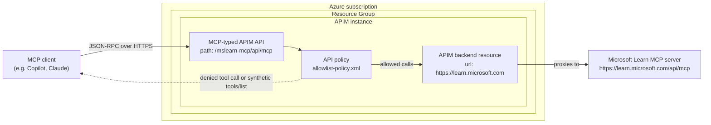

# Azure APIM MCP Gateway demo

- Created and maintained by **[Katie Kodes](https://katiekodes.com/)**, 8/17/2026.
- Accompanying blog post:  "[How to censor MCP servers with Azure APIM](https://katiekodes.com/censor-mcp-with-apim/)"

Azure APIM to disable specific tools from MCP servers, to cut off legs of the lethal trifecta stool.

This is a demo/proof-of-concept showing how to put an external, remote [Model Context Protocol
(MCP)](https://modelcontextprotocol.io/) server behind [Azure API Management](https://learn.microsoft.com/azure/api-management/mcp-server-overview)
so that only an **allow-listed subset** of its tools is reachable by MCP clients (GitHub Copilot, Claude, or anything else).

It gates the public
[Microsoft Learn MCP server](https://learn.microsoft.com/api/mcp) as a concrete example: only
`microsoft_docs_search` and `microsoft_docs_fetch` are allowed to be listed and are allowed through; the remaining tools _(currently just `microsoft_code_sample_search`)_ should be blocked with a JSON-RPC "method not found" error, as implemented in [Azure Blog author Sam Cogan's demo](https://techcommunity.microsoft.com/blog/appsonazureblog/controlling-tool-access-with-apim-mcp-gateway/4529225).

## Why

MCP tool servers can combine three risky ingredients at once - private/sensitive data access, exposure to untrusted content, and the ability to communicate externally - sometimes called the ["lethal trifecta"](https://simonwillison.net/2025/Jun/16/the-lethal-trifecta/) _(h/t Simon Willison)_.

One way to reduce that risk is to make sure agents/LLM hosts can only reach a deliberately narrow, reviewed set of tools, instead of everything a given MCP server happens to expose.

This repo demonstrates Terraform that implement's Microsoft's suggested way to enforce that narrowing centrally, in front of the server, using Azure API Management - rather than trusting each and every client's / agent's configuration to only select the "safe" tools on its own.

Then you can use various enterprise tools to ensure that no one is able to use the original MCP server, but can use your APIM-proxied less-capable version:

1. Firewalls
2. Enterprise LLM harness configurations, such as GitHub Enterprise Cloud settings to allow-list using GitHub Copilot only with specific MCP servers

## How it works

Azure API Management (Basic v2 tier or above) can register an existing external MCP server as a managed "API" of type `mcp`, and proxy ("pass through") requests to it.

Unlike REST-API-backed MCP servers, APIM cannot natively discover or individually manage an *external* MCP server's tools (the portal will tell you: "Tools are not visible for external MCP servers").

So instead, this sample repo attaches an APIM **policy** that inspects the raw JSON-RPC traffic between the client and the backend MCP server, using the same business decisions as in Sam's blog post:

- `tools/list` requests never reach the backend at all - APIM synthesizes and returns a response containing only the allow-listed tool(s).
- `tools/call` requests for a denied tool are short-circuited with a JSON-RPC `-32601` ("method not found") error before ever reaching the backend.
- Everything else (`initialize`, `ping`, calls to allowed tools, etc.) passes through untouched.

See [`.prereqs/AA-tf/modules/mcp_limiter_demo/allowlist-policy.xml`](.prereqs/AA-tf/modules/mcp_limiter_demo/allowlist-policy.xml) for the actual policy, and its header comment for implementation notes and gotchas encountered along the way (e.g. why the backend must be a separate `backends` resource rather than a bare `serviceUrl`).

## Reference architecture

The Terraform in [`.prereqs/AA-tf/`](.prereqs/AA-tf/) creates this logical architecture:

### Runtime request paths

1. `tools/list` to APIM
    - APIM policy returns a synthetic tool list containing only:
       - `microsoft_docs_search`
       - `microsoft_docs_fetch`
    - Backend is not called.
2. `tools/call` for `microsoft_code_sample_search`
    - APIM policy returns JSON-RPC error `-32601` (method not found).
    - Backend is not called.
3. `initialize`, `ping`, and `tools/call` for allow-listed tools
    - Request is proxied through APIM backend to Microsoft Learn MCP.

### Terraform component mapping

- Resource group: root config in [`.prereqs/AA-tf/main.tf`](.prereqs/AA-tf/main.tf)
- APIM instance: module [`.prereqs/AA-tf/modules/shared_apim_instance/main.tf`](.prereqs/AA-tf/modules/shared_apim_instance/main.tf)
- External MCP backend + MCP API + policy: module [`.prereqs/AA-tf/modules/mcp_limiter_demo/main.tf`](.prereqs/AA-tf/modules/mcp_limiter_demo/main.tf)
- Allow-list logic: [`.prereqs/AA-tf/modules/mcp_limiter_demo/allowlist-policy.xml`](.prereqs/AA-tf/modules/mcp_limiter_demo/allowlist-policy.xml)

## Repo layout

- **`.prereqs/AA-tf/`** - Terraform that provisions the Azure resources: a resource group, an API
  Management instance (Basic v2, the minimum tier that supports MCP servers), and the gated MCP
  server API + policy described above. Uses the [`azapi`](https://registry.terraform.io/providers/Azure/azapi/latest)
  provider, since `azurerm` doesn't yet support the MCP-related resource types.
  - `zzz-run-something-like-this-to-plan.ps1` / `-to-apply.ps1` / `-to-destroy.ps1` - convenience
    wrappers around `terraform plan`/`apply`/`destroy`, reading a few required variables
    (Azure subscription ID, Entra tenant ID, a nickname used in resource names) from user-scoped
    environment variables so no real identifiers need to live in this repo.
- **`.prereqs/BB-test-if-AA-tf-actually-gatekeeps/`** - A small Node/TypeScript/[Vitest](https://vitest.dev/)
  end-to-end smoke test suite, using the official
  [`@modelcontextprotocol/sdk`](https://www.npmjs.com/package/@modelcontextprotocol/sdk) client.
  It calls the public Microsoft Learn MCP server directly (as a baseline - nothing should be
  blocked) and then calls it again through the APIM gateway (only the allow-listed tool should
  work; the rest should be cleanly rejected).
  - `zzz-run-something-like-this-to-test.ps1` - reads the APIM instance name out of the Terraform
    state file, builds the gateway's URL, and runs the test suite against both the direct server
    and the gateway.

## Prerequisites

- PowerShell 7
- An Azure subscription and an Entra ID tenant you're allowed to create resources in.
- [Terraform](https://developer.hashicorp.com/terraform/install) and the [Azure CLI](https://learn.microsoft.com/cli/azure/install-azure-cli),
  logged in (`az login`) as a principal with sufficient permissions to create the resources above.
- [Node.js](https://nodejs.org/) and npm, for running the test suite.
- [`jq`](https://jqlang.org/), used by the test-runner script to read Terraform's state file.

## Usage

1. Set the following user-scoped environment variables (never checked into this repo):
   `DEMOS_my_entra_tenant_id`, `DEMOS_my_azure_subscription_id`, `DEMOS_my_workload_nickname`.
2. From `.prereqs/AA-tf/`, run `zzz-run-something-like-this-to-plan.ps1` to preview, then
   `zzz-run-something-like-this-to-apply.ps1` to provision the Azure resources.
3. From `.prereqs/BB-test-if-AA-tf-actually-gatekeeps/`, install dependencies (`npm ci`) and run
   `zzz-run-something-like-this-to-test.ps1` to verify the gateway is actually enforcing the
   allow-list.
4. When you're done, run `zzz-run-something-like-this-to-destroy.ps1` (from `.prereqs/AA-tf/`) to
   tear everything down.

## Disclaimer

This is a demo, not a production-ready reference architecture.
